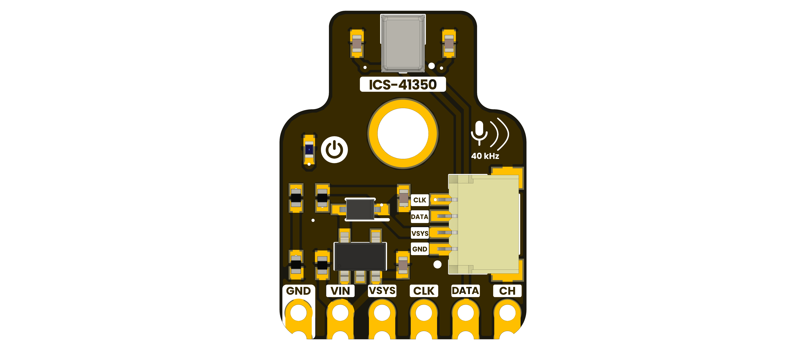

# DevLab: PDM ICS-41350 MEMS Microphone Module
<!-- Exception:

The PULSAR development board line does not use the DevLab: prefix.

Format: PULSAR [MCU/Model]

Examples: PULSAR C6, PULSAR H2, PULSAR RP2350

The JUN R3 board also does not use DevLab:

Example: JUN R3 -->

## Introduction

The DevLab PDM ICS-41350 MEMS Microphone is a digital audio module built around
the bottom-port TDK InvenSense ICS-41350. The microphone provides a 1-bit PDM
output and supports low-power, standard, high-performance, and sleep modes
selected by the clock frequency. The BOM identifies an onboard 3.3 V regulator
and indicator LED; the artwork shows channel selection, six castellated
connections, and a four-position 1.0 mm-pitch connector.

  
  
<em>DevLab PDM ICS-41350 MEMS Microphone</em>

### Quick Setup

## Overview

| Feature | Description |
|---|---|
| Product | DevLab PDM ICS-41350 MEMS Microphone |
| Manufacturer Part Number | UE0148 |
| Hardware Revision | V1.1 artwork |
| Microphone | TDK InvenSense ICS-41350 bottom-port digital MEMS microphone |
| Interface | 1-bit pulse-density modulation (PDM) |
| Exposed Signals | `GND`, `VIN`, `VSYS`, `CLK`, `DATA`, `CH` |
| Regulator | AP2112K-3.3TRG1 fixed 3.3 V LDO, as identified by the BOM |
| Connectors | 1×6 2.54 mm header footprint and 4-position 1.0 mm-pitch connector |
| Validation Status | Module input limits, total current, dimensions, and solder-option defaults pending validation |

## Applications

- Voice capture and voice-recognition prototypes
- Microphone arrays
- Camera and security or surveillance audio
- Low-power ambient sound analysis and keyword-spotting prototypes
- Ultrasonic sensing experiments using the ICS-41350 high-performance mode

## Resources

- **Schematic Diagram:** pending schematic verification
- **Pinout Diagram:** pending publication; an artwork-backed pin table is maintained in `hardware/README.md`
- **Getting Started Guide:** pending publication
- [ICS-41350 Datasheet](https://www.invensense.tdk.com/en-us/products/microphone/ics-41350)

## 📝 License

All hardware and documentation in this project are licensed under the MIT
License included with the repository.

## Note of Development

This product documentation is under active development. The V1.1 artwork and
manufacturing BOM establish the visible pin labels and fitted component
identities; module-level electrical limits, dimensions, schematic topology,
and tested host configurations remain pending validation.

  Template created by UNIT Electronics

