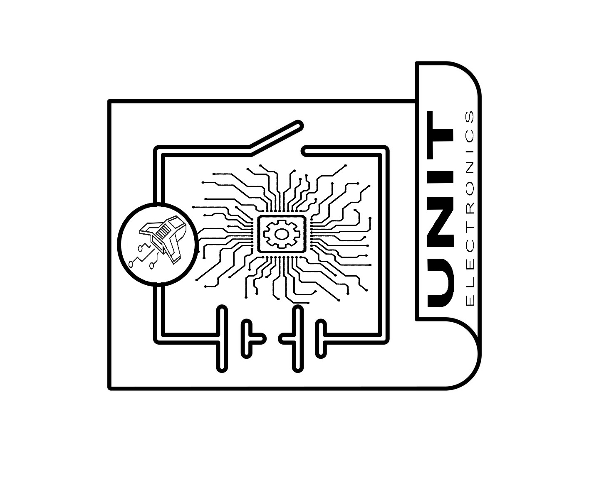

# Hardware

This guide describes the hardware interface and operating limits of
DevLab PDM ICS-41350 MEMS Microphone, Mfr. Part # **UE0148**.

## Hardware Resources

  <a href="./unit_sch_v_1_2_1_ue0148_devlab_pdm_ics_41350_mems_microphone.pdf">
     
    Schematic
  </a>

The V1.1 artwork identifies this board as a DevLab PDM microphone module based
on the ICS-41350. The manufacturing BOM identifies the following principal
parts; their component ratings must not be treated as complete module ratings.

| Ref. | BOM identification | Role |
|---|---|---|
| MK1 | ICS-41350 | Bottom-port PDM MEMS microphone |
| U3 | AP2112K-3.3TRG1 | Fixed 3.3 V LDO regulator |
| D2 | NSR0320MW2T1G | Schottky diode in the power section |
| D1 | 16-213/S2C-BM2P1VY/3T(XY) | Orange indicator LED |
| J1 | Generic male header, 1×6, 2.54 mm | Edge/header connection |
| J2 | HCZZ0032-4, 4-position, 1.0 mm pitch | Right-angle board connector |
| C8, C9 | 1 µF, 6.3 V, X5R | Power-section capacitors |
| C6 | 100 nF | Microphone decoupling capacitor |
| C1 | 200 pF, C0G | Signal capacitor |
| R1 | 4.7 kΩ | LED resistor |
| R2, R3 | 10 kΩ | Pull down resistors |
| R5 | 0 Ω | Configuration resistor |

The BOM also lists a four-pin, 1.0 mm-pitch QWIIC harness.

## Pinout

    <a href="./unit_pinout_v_1_2_1_devlab_pdm_ics_41350_mems_microphone_en.pdf"> Pinout</a>
     
     
     

Pin labels visible in the V1.1 top artwork

| Pin Label | Direction | Function | Validation note |
|---|---|---|---|
| `GND` | Power | Common ground | Artwork-confirmed |
| `VIN` | Power input | Input to the module power section | 5V - 3.3V |
| `VSYS` | Power | Module system rail | 3.3V |
| `CLK` | Input | PDM clock input | Sensor clock modes are listed below; module-level VSYS |
| `DATA` | Output | PDM microphone data | Artwork-confirmed signal name |
| `CH` | Input | Microphone channel selection | Low/right and high/left apply to the ICS-41350 `CH` pin. It could be configured via hardware or firmware |

### ICS-41350 clock-selected modes

These are sensor specifications from the ICS-41350 datasheet, not independently
validated module ratings.

| ICS-41350 mode | Clock frequency |
|---|---:|
| Sleep | Below 200 kHz |
| Low power | 400 to 800 kHz |
| Standard | 1.0 to 3.3 MHz |
| High performance | 4.1 to 4.8 MHz |

## Dimensions

<a href="./resources/unit_dimensions_v_1_2_1_devlab_pdm_ics_41350_mems_microphone.png">
 
Dimensions
</a>

---
## Topology

<a href="./resources/unit_topology_v_1_2_1_devlab_pdm_ics_41350_mems_microphone.png">
 
Topology
</a>

### Topology Description

## Pin & Connector Layout

| Connection | Visible signals | Notes |
|---|---|---|
| J1 / edge row | `GND`, `VIN`, `VSYS`, `CLK`, `DATA`, `CH` | Six positions shown by the artwork and BOM |
| J2 | `GND`, `VSYS`, `DATA`, `CLK` | Four contacts shown in the top artwork; pin numbering and cable orientation pending validation |

The bottom artwork also labels `CH SELECTION L/R` and `LED ON ENABLE` solder
options. Their default copper states and exact circuit behavior are pending
schematic verification.

## Functional Description

The ICS-41350 converts sound pressure at its bottom acoustic port into a 1-bit
PDM stream. A host supplies `CLK` and receives `DATA`. At the sensor, the
`SELECT` input assigns the right channel when low (tied to ground) and the left
channel when high (tied to the sensor supply). Two sensors can time-multiplex a
shared data line by using opposite channel assignments.

The sensor datasheet specifies a 1.65 V to 3.63 V supply at the ICS-41350 `VDD`
pin. It also specifies typical SNR of 64 dBA in standard and high-performance
modes, 120 dB SPL AOP in standard and low-power modes, and 126 dB SPL AOP in
high-performance mode. These are sensor characteristics and do not establish
the permitted `VIN` or `VSYS` range, total module current, or host logic levels.

The BOM identifies U3 as a fixed 3.3 V AP2112K regulator. The relationship
between `VIN`, `VSYS`, U3, D2, J2, and the LED-enable option remains pending
schematic verification.

## Applications

- Voice capture and recognition prototypes
- Microphone-array development
- Camera, security, and surveillance audio
- Low-power ambient sound analysis
- Ultrasonic sensing experiments in the ICS-41350 high-performance mode

# References

- [ICS-41350 product page and datasheet](https://www.invensense.tdk.com/en-us/products/microphone/ics-41350)
- **Manufacturing BOM:** reviewed locally; public URL pending
- **Product repository:** public URL pending
